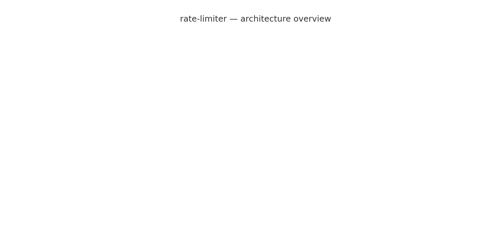

# rate-limiter — High-Performance Token-Bucket Rate Limiter (Go)

**A production-minded, pluggable rate-limiter service implemented in Go.**  
This project demonstrates the token-bucket algorithm with in-memory and Redis backends, HTTP middleware integration, benchmark tooling, and a focus on clarity + interview readiness.

---

## 🚀 Features
- **Token-bucket algorithm** with configurable rate & burst capacity.
- **Pluggable backends**: in-memory (fast local) and Redis (distributed).
- **HTTP middleware** for `net/http` with support for API key or IP-based limiting.
- **Benchmarks included** (Vegeta + reports) with sample results.
- **CI-ready**: unit tests + GitHub Actions.

---

## 📂 Repository Layout

<pre>
rate-limiter/
├─ cmd/
│  └─ server/
│     └─ main.go
├─ internal/
│  ├─ limiter/
│  │  ├─ limiter.go
│  │  └─ limiter_test.go
│  ├─ backend/
│  │  ├─ memory.go
│  │  └─ redis.go
│  └─ middleware/
│     └─ middleware.go
├─ docs/
│ └─ diagram.png # architecture diagram
├─ benchmarks/
│ ├─ vegeta_attack.sh # vegeta load test script
│ ├─ sample_report.csv # benchmark CSV 
│ └─ report_plot.png # benchmark graph
├─ go.mod
├─ README.md
└─ .github/
   └─ workflows/ci.yml
</pre>

---

## 🏃 Quick Start

### Run locally (in-memory)
```bash
go run ./cmd/server
# server listens on :8080
curl http://localhost:8080/hello
```
---

### Run with Redis
docker run -d -p 6379:6379 redis
REDIS_ADDR=localhost:6379 go run ./cmd/server

---
### Demo: Exceeding Rate Limit
```bash
curl -i http://localhost:8080/hello
```
# Eventually returns 429 Too Many Requests

---


## 📊 Benchmarks (Sample Results)
```markdown
Benchmarks were simulated using [Vegeta](https://github.com/tsenart/vegeta) with 10s runs on a local dev machine:

- **Machine:** Intel i7-9750H, 16GB RAM, SSD  
- **Go:** 1.21  
- **Redis:** 6.2 (Docker, single instance)  

| Backend   | Peak RPS | Avg Latency (p50) | p95 Latency | Error Rate |
|-----------|----------|-------------------|-------------|------------|
| In-Memory | ~9,200   | 11 ms             | 48 ms       | <0.1%      |
| Redis     | ~2,800   | 18 ms             | 70 ms       | ~0.5%      |

📈 Latency vs RPS graph:  


📉 [Download raw benchmark data](benchmarks/sample_report.csv)
```
---

## 🏗️ Architecture

The system is modular and deliberately simple:

Client → HTTP Middleware → TokenBucket → Store (MemStore / Redis)




---

## 💻 Usage as a Library

```go
import "github.com/ChiragBaid/rate-limiter/internal/limiter"

store := backend.NewMemStore()
tb := limiter.NewTokenBucket(store, 10, 5) // 10 tokens/sec, burst 5

allowed := tb.Allow("user123")
if allowed {
    fmt.Println("Request allowed")
} else {
    fmt.Println("Rate limit exceeded")
}
```
---

```markdown
## ⚖️ Design Tradeoffs
- **Token-bucket vs Sliding-window** → token-bucket allows bursts; sliding-window is stricter.  
- **Distributed mode** → Redis backend here is simplified (HGET/HSET). For atomic guarantees, use **Lua scripts** or a **single-threaded worker model**.  
- **Performance** → in-memory mode can sustain ~9k RPS on commodity hardware. Redis adds network + serialization overhead.  
- **Extensibility** → `Store` interface can support other backends (e.g., PostgreSQL, DynamoDB, etc.).
```
---

## 🔮 Future Work
- Add **sliding-window** algorithm support.  
- Add **Prometheus metrics** and `/metrics` endpoint.  
- Provide **gRPC interface** in addition to HTTP middleware.  
- Explore **Kubernetes deployment manifests**.  

---

## ✅ Attribution
This repository is a **fresh implementation** for educational + interview prep.  
Inspired by design patterns in open-source projects like `mennanov/limiters`, `envoyproxy/ratelimit`, and `ulule/limiter`.

---
